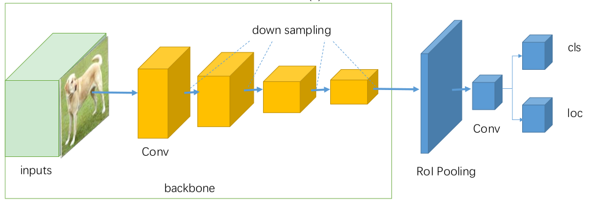
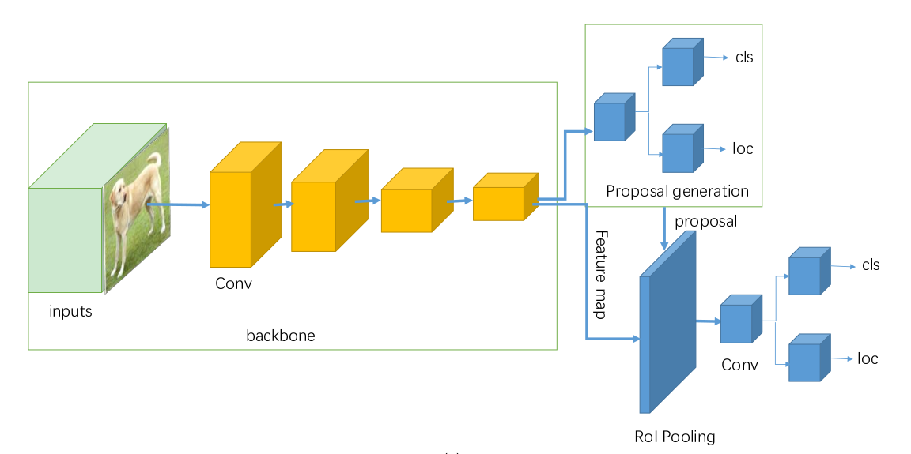

# Object-detection
Start date: 8 June, 2021

In this project, I will write a summary that my understanding is object detection topic:

I. Overview

Object detection is the task of classification and localization of object in an image or video. Object
detectors need a powerful backbone network to extract rich.

The goals of object detection is to recognise instances of a predefined set of object classes(people, cars, bikes,..) 
and describe the locations of each detected object in the image using a bounding box. 
features.

There are two kinds of object detector:

1. One stage detector: YOLO, SSD, RetinaNet

   
The one-stage detectors: 

+ Propose predicted boxes from input images directly without region proposal step,
thus they are time efficient and can be used for real-time devices.
  
+ Perform classification and regression on dense anchor boxes without generating a sparse RoI set.

+ Using single convolutional network predicts the bounding boxes and the class probabilities for these boxes.

2. Two stage detector: Fast R-CNN

   
+ The basic architecture of two stage of includes region proposal network to feed region proposals into classifier and
regressor.

+ Sparse region proposals are generated in the first stage and then are further regressed and classified in the second stage

II. One-stage detector for YOLO

There are three versions for YOLO. In this part, I will summary from YOLO V1 to YOLO V3

- YOLO V1:
    - Idea for object detection:
        + YOLO splits image into SxS 

Reference:

[1] https://arxiv.org/pdf/2104.11892.pdf

[2] https://arxiv.org/pdf/1907.09408.pdf

[3] https://www.ecva.net/papers/eccv_2020/papers_ECCV/papers/123590528.pdf

[4] https://nghichcodechovui.blogspot.com/2020/03/giai-thich-ly-thuyet-cua-yolo-v3.html

[5] https://aicurious.io/posts/tim-hieu-yolo-cho-phat-hien-vat-tu-v1-den-v5/

[6] https://forum.machinelearningcoban.com/t/object-detection-yolo/503

[7] https://lilianweng.github.io/lil-log/2018/12/27/object-detection-part-4.html